# Hệ thống Quản lý Hiệu thuốc Tây (Pharmacy Management System)


> **Đồ án Môn học Phát Triển Ứng Dụng**
>
> Ứng dụng Desktop quản lý bán lẻ thuốc tây, thực phẩm chức năng theo tiêu chuẩn GPP, tối ưu hóa quy trình xuất kho FEFO và tích hợp bán hàng bằng máy quét mã vạch.

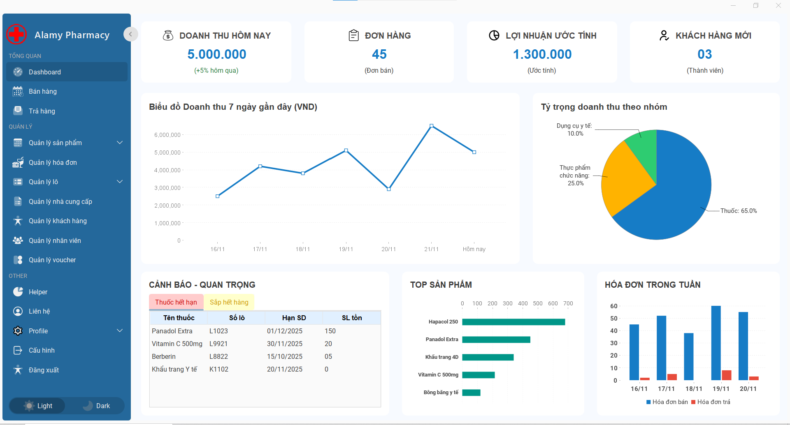

## Giới thiệu (Introduction)

**Pharmacy Management System** (PMS) được thiết kế để giải quyết các "nỗi đau" của các nhà thuốc truyền thống: thất thoát hàng hóa, khó kiểm soát hạn sử dụng và sai sót trong tính toán doanh thu.

Hệ thống được xây dựng trên nền tảng **Java Swing** hiện đại (FlatLaf), kết nối cơ sở dữ liệu **SQL Server**, đảm bảo hoạt động ổn định, bảo mật và không phụ thuộc vào internet (Offline-first).

---

## 📥 Tải xuống & Cài đặt nhanh (Download & Run)

Nếu bạn không muốn cài đặt môi trường lập trình (IDE), bạn có thể tải bản đóng gói sẵn để chạy ngay:

1.  Truy cập mục **[Releases](https://github.com/BuiTrungKien333/pharmacy-management-java-public/releases)** bên phải giao diện GitHub.
2.  Tải file `PharmacyManagementApp.jar` (và file `run.bat`).
3.  Đảm bảo máy tính đã cài **Java JDK 21**.
4.  Cấu hình Database (chạy script SQL trong SSMS) và file `db.properties` (xem hướng dẫn bên dưới).
5.  Click đúp vào file `.jar` (hoặc `run.bat`) để khởi động phần mềm.
6.  (Tùy chọn) Có thể di chuyển `PharmacyManagementApp.jar` ra ngoài màn hình Desktop và set icon là `logo.ico` để trông như một chương trình thực sự (vd: Eclipse, Chrome,...)

---

## Tính năng nổi bật (Key Features)

### 1. Quản lý Kho & Thuốc (Inventory GPP)

- **Nguyên tắc FEFO (First Expired, First Out):** Tự động gợi ý xuất kho lô thuốc hết hạn trước bán trước.
- **Cảnh báo thông minh:** Tự động đổi màu (Vàng/Đỏ) đối với các lô thuốc cận date (< 30 ngày) hoặc đã hết hạn.
- **Đơn vị tính đa cấp:** Hỗ trợ quy đổi linh hoạt: _Thùng ➔ Hộp ➔ Vỉ ➔ Viên_.
- **Truy xuất nguồn gốc:** Tìm kiếm nhanh hóa đơn nhập/xuất của một lô thuốc cụ thể để xử lý thu hồi khi có sự cố.

### 2. Bán hàng & POS (Point of Sale)

- **Tốc độ xử lý < 3s:** Tối ưu hóa thao tác bằng phím tắt (Keyboard-first) và máy quét mã vạch (Barcode Scanner).
- **Xử lý đa lô:** Tự động lấy thuốc từ nhiều lô khác nhau trong cùng 1 đơn hàng nếu lô trước không đủ số lượng.
- **Thanh toán linh hoạt:** Tính toán tiền thừa, chiết khấu Voucher tự động.
- **In hóa đơn:** Hỗ trợ in nhiệt khổ 58mm/80mm ngay lập tức.

### 3. Báo cáo & Quản trị (Reporting)

- **Dashboard Real-time:** Biểu đồ doanh thu, lợi nhuận hiển thị trực quan (JFreeChart).
- **Xuất Excel:** Xuất báo cáo doanh thu, tồn kho ra file Excel chuẩn định dạng (.xlsx) nhờ Apache POI.
- **Phân quyền chặt chẽ (RBAC):** Tách biệt quyền hạn giữa Admin (Chủ nhà thuốc) và Dược sĩ bán hàng.
- **Bảo mật (BCrypt, OTP):** Mã hóa mật khẩu, xác thực OTP qua Email khi quên mật khẩu.

## Công nghệ sử dụng (Tech Stack)

| Thành phần                | Công nghệ / Thư viện   | Vai trò                           |
| ------------------------- | ---------------------- | --------------------------------- |
| **Core Language**         | Java JDK 21            | Main Programming Language         |
| **GUI Framework**         | Java Swing             | Desktop User Interface            |
| **UI Theme**              | FlatLaf                | Modern Look & Feel                |
| **Layout Manager**        | MigLayout              | Responsive Layout Management      |
| **Database**              | Microsoft SQL Server   | Data Storage                      |
| **Data Access**           | JDBC (mssql-jdbc)      | Native SQL Queries                |
| **Connection Pool**       | HikariCP               | High Performance DB Pool          |
| **Security**              | BCrypt (at.favre.lib)  | Password Hashing                  |
| **Barcode**               | Google ZXing           | Barcode Generate & Scan           |
| **Reporting**             | Apache POI, JFreeChart | Excel Export & Charts             |
| **Logging**               | SLF4J + Logback        | Application Logging               |
| **Configuration**         | Owner                  | External Config Management        |
| **Boilerplate Reduction** | Lombok                 | Auto Getter/Setter                |
| **Build Tool**            | Maven                  | Dependency & Packaging Management |

## Kiến trúc hệ thống (Architecture)

Dự án áp dụng mô hình kiến trúc đa tầng **(3-Layer Architecture)** giúp code trong sáng, dễ bảo trì và mở rộng:

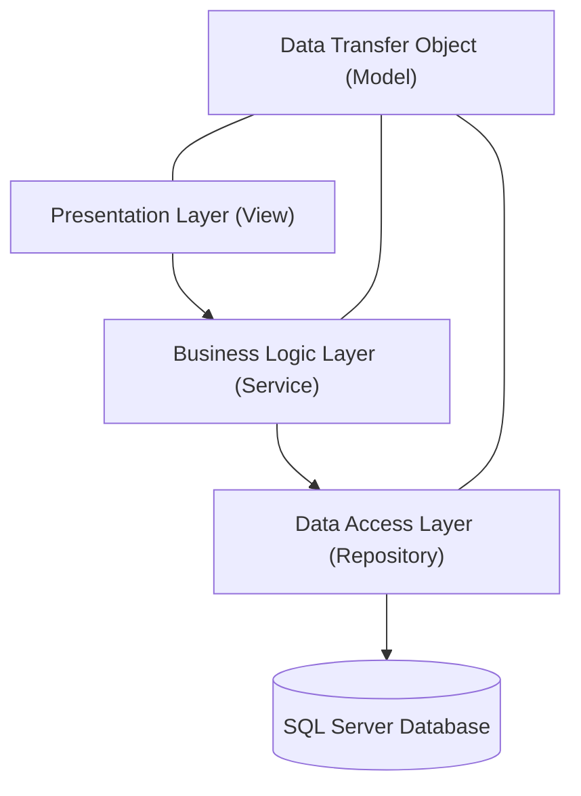

1. GUI (View): Các Form, Dialog giao tiếp người dùng (sử dụng Swing & MigLayout).

2. BUS (Business): Xử lý nghiệp vụ (Tính toán tiền, logic FEFO, Validation).

3. DAO (Data): Thực thi câu lệnh SQL, kết nối Database qua JDBC.

---

## 📂 Cấu trúc dự án (Project Structure)

Dự án được tổ chức theo kiến trúc đa tầng (N-Tier Architecture), phân chia rõ ràng giữa các lớp xử lý dữ liệu, nghiệp vụ và giao diện:

```text
Pharmacy-Management-System/
├── 📂 database/           # Script SQL tạo CSDL (script.sql)
├── 📂 docs/               # Tài liệu hướng dẫn & Báo cáo
├── 📂 screenshots/        # Hình ảnh demo
├── 📂 src/
│   ├── 📂 main/
│   │   ├── 📂 java/com/pharmacy/
│   │   │   ├── 📂 app/        # Main Class (Điểm khởi chạy ứng dụng)
│   │   │   ├── 📂 bus/        # Business Logic (Xử lý nghiệp vụ chính)
│   │   │   ├── 📂 config/     # Các lớp cấu hình hệ thống (Properties, Session)
│   │   │   ├── 📂 connectDB/  # Quản lý kết nối JDBC tới SQL Server
│   │   │   ├── 📂 dao/        # Data Access Object (Truy vấn CSDL)
│   │   │   ├── 📂 dto/        # Data Transfer Object (Chuyển dữ liệu giữa các tầng)
│   │   │   ├── 📂 entity/     # Các lớp thực thể (Ánh xạ bảng CSDL)
│   │   │   ├── 📂 exception/  # Xử lý các ngoại lệ tùy chỉnh (Custom Exceptions)
│   │   │   ├── 📂 gui/        # Giao diện người dùng (Swing Forms, Dialogs)
│   │   │   └── 📂 utils/      # Các tiện ích chung (Format tiền, Date, Validate)
│   │   └── 📂 resources/      # Tài nguyên (Images, Icons, db.properties, application.properties)
├── 📄 pom.xml             # Quản lý thư viện Maven
└── 📄 README.md           # Tài liệu dự án
```

## ⚙️ Hướng dẫn cài đặt (Installation)

Để cài đặt và chạy thử nghiệm phần mềm, bạn vui lòng thực hiện theo các bước sau:

### 1. Yêu cầu hệ thống

- **Java:** JDK 21 trở lên.
- **Database:** SQL Server (2019 trở lên).

### 2. Các bước triển khai

**Bước 1: Clone dự án về máy**

```bash
git clone https://github.com/BuiTrungKien333/pharmacy-management-java-public.git
```

**Bước 2: Cấu hình Cơ sở dữ liệu**

- Mở SQL Server Management Studio (SSMS).
- Chạy file script tại thư mục: database/script.sql để tạo Database và dữ liệu mẫu.
- Cấu hình lại thông tin đăng nhập trong file db.properties

**Bước 3: Xem tài liệu chi tiết**

- Để xem hướng dẫn từng bước bằng hình ảnh, vui lòng đọc file PDF tại:  
  [Hướng Dẫn Cài Đặt](docs/HuongDanCaiDat.pdf)

**Bước 4: Các thiết bị hỗ trợ**

- Máy quét mã vạch barcode và QR code (**Lưu ý**: Có thể sử dụng `điện thoại` nếu không có máy quét chuyên dụng)
- Máy in hóa đơn nhiệt

## 📸 Một số hình ảnh Demo (Screenshots)

Dưới đây là một số hình ảnh thực tế của phần mềm:

### 1. Tổng quan & Bảo mật

Giao diện đăng nhập hiện đại và Dashboard thống kê trực quan tình hình kinh doanh.

|       Đăng nhập hệ thống        |           Dashboard Tổng quan           |
| :-----------------------------: | :-------------------------------------: |
| 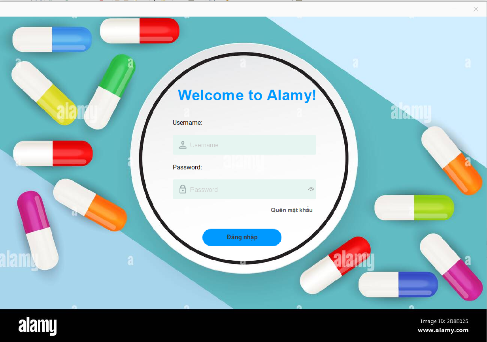 |  |
|  _Giao diện đăng nhập bảo mật_  |     _Thống kê doanh thu & Cảnh báo_     |

### 2. Nghiệp vụ Bán hàng (POS)

Quy trình bán hàng tối ưu thao tác, hỗ trợ in hóa đơn nhiệt ngay lập tức.

|      Giao diện Bán hàng (POS)      |         Hóa đơn thanh toán          |
| :--------------------------------: | :---------------------------------: |
|   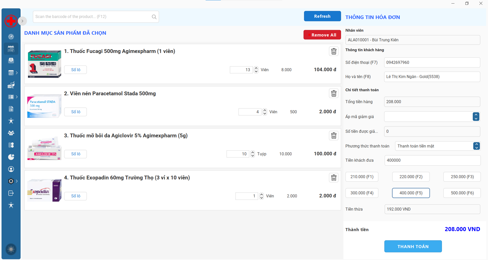    | 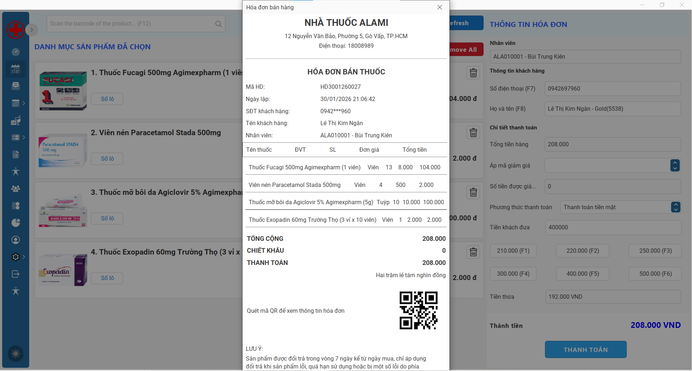 |
| _Bán hàng bằng mã vạch & Phím tắt_ |   _Mẫu hóa đơn in ra (Khổ 80mm)_    |

### 3. Quản lý Sản phẩm & Kho hàng (Core)

Quản lý chi tiết từng lô thuốc (Batch), hạn sử dụng (Expiry Date) và giá vốn.

|               Quản lý Danh sách Sản phẩm               |             Chi tiết Sản phẩm              |
| :----------------------------------------------------: | :----------------------------------------: |
| 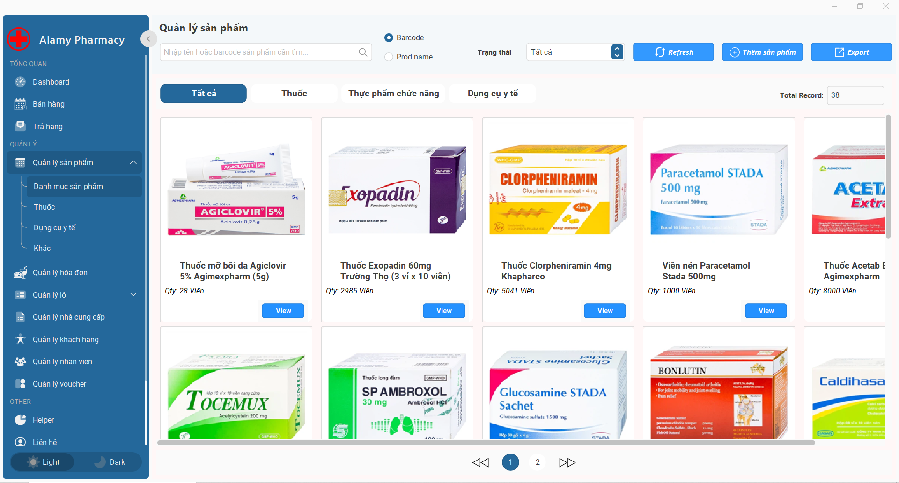 | 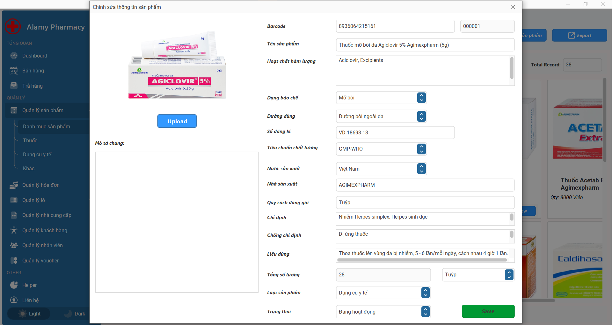 |
|              _Danh sách thuốc & Tồn kho_               |       _Thêm mới/Xem chi tiết thuốc_        |

|          Quản lý Lô & Hạn dùng (FEFO)           |
| :---------------------------------------------: |
|   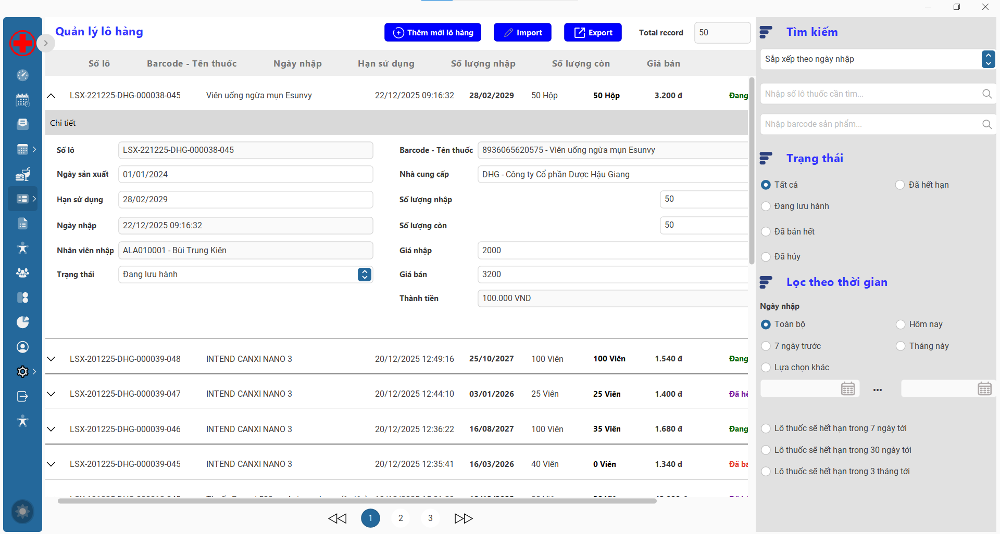    |
| _Quản lý từng lô nhập, cảnh báo thuốc cận date_ |

### 4. Quản lý Hóa đơn & Đổi trả

Tra cứu lịch sử giao dịch và xử lý quy trình khách trả lại hàng.

|                      Quản lý Hóa đơn                      |          Xử lý Trả hàng           |
| :-------------------------------------------------------: | :-------------------------------: |
| 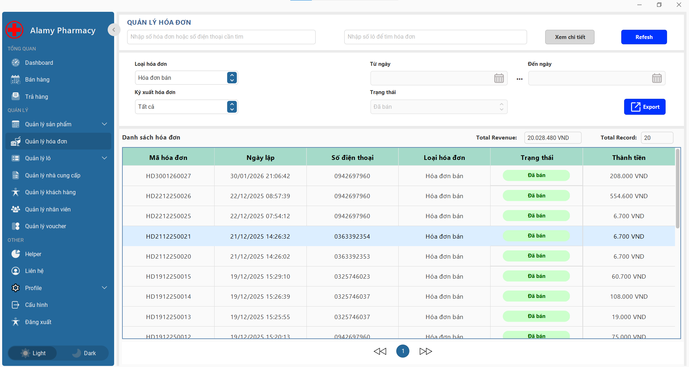 | 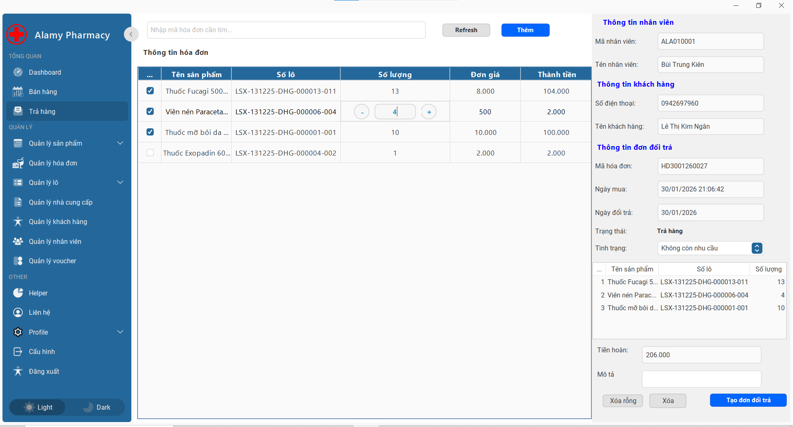 |
|              _Tra cứu & Xem lại hóa đơn cũ_               | _Nhập phiếu trả hàng & Hoàn tiền_ |

### 5. Tiện ích khác

Tính năng hỗ trợ người dùng khi quên mật khẩu thông qua Email.

|               Quên mật khẩu (OTP)               |
| :---------------------------------------------: |
| 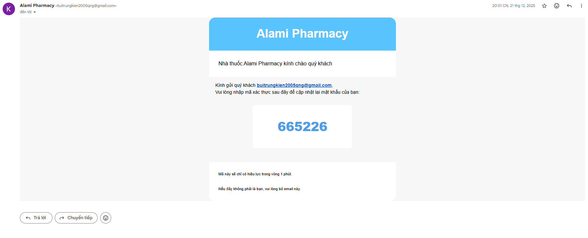 |
| _Xác thực OTP gửi về Email để cấp lại mật khẩu_ |

## 📅 Lịch sử phiên bản (Version History)

v1.0.0 (Latest - 8/2025):

🎉 Phát hành phiên bản chính thức.

## 📞 Liên hệ (Contact)

- Tác giả: Bùi Trung Kiên

- Email: buitrungkien2005qng@gmail.com

- Zalo / Phone: 0363 392 352

- Facebook: Trung Kiên
